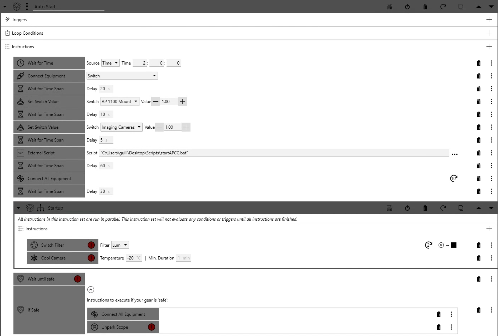
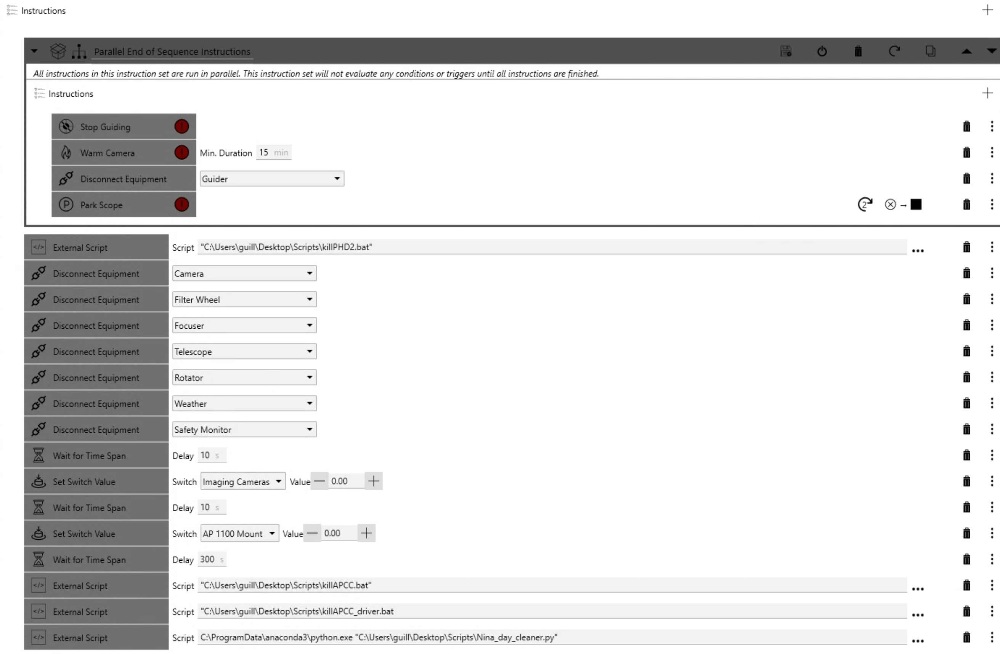
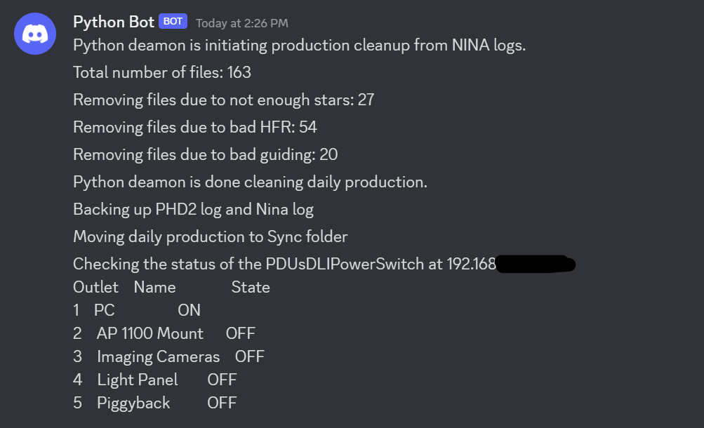

# NINA
Script for NINA start up and end
## NINA Start up scripts

Wait for a certain time.

Use NINA switches and the PDU ASCOM driver to connect to the Digital Loggers Web Powerswitch.

### Alternative
One weakness of NINA is that you can use switches with only one ASCOM driver. If you need to connect to 2 PDUs, or one PDU and one PEGSUS power box, NINA can't do it. 
I provide however a work around: you could use the python programs provided to connect to your Digital Loggers Web Powerswitch, which then frees the NINA switches
for, for example a PEGASUS power switch accessed via ASCOM.

Power up the Mount's bus then the equipment's bus.

Start APCC via script, alternativly use the APCC start module in AP tools

If safe, unpark and start the imaging sequence.

## NINA end of session and shut down scripts

Stop guiding, disconnect the guider and park the scope while warming up the camera slowly.

Then kill phd2.

Disconnect the rest of the equipment, EXCEPT, of course, the switch (so can't use "Disconnet all").

Once the Telescope is disconnected and the Mount is powered down, APCC should autoclose on its own after 1 minute, if properly configured. Except sometimes it does not, so for additional safety, kill APCC after 5mn just in case it failed to autoclose.

Same for the AP driver.

Then run a python script to clean up last night production using the NINA CSV. NINA needs to be configured to produce the CSV within the Session Metadata plugin tab. Use the defaul in the plugin settings page.

